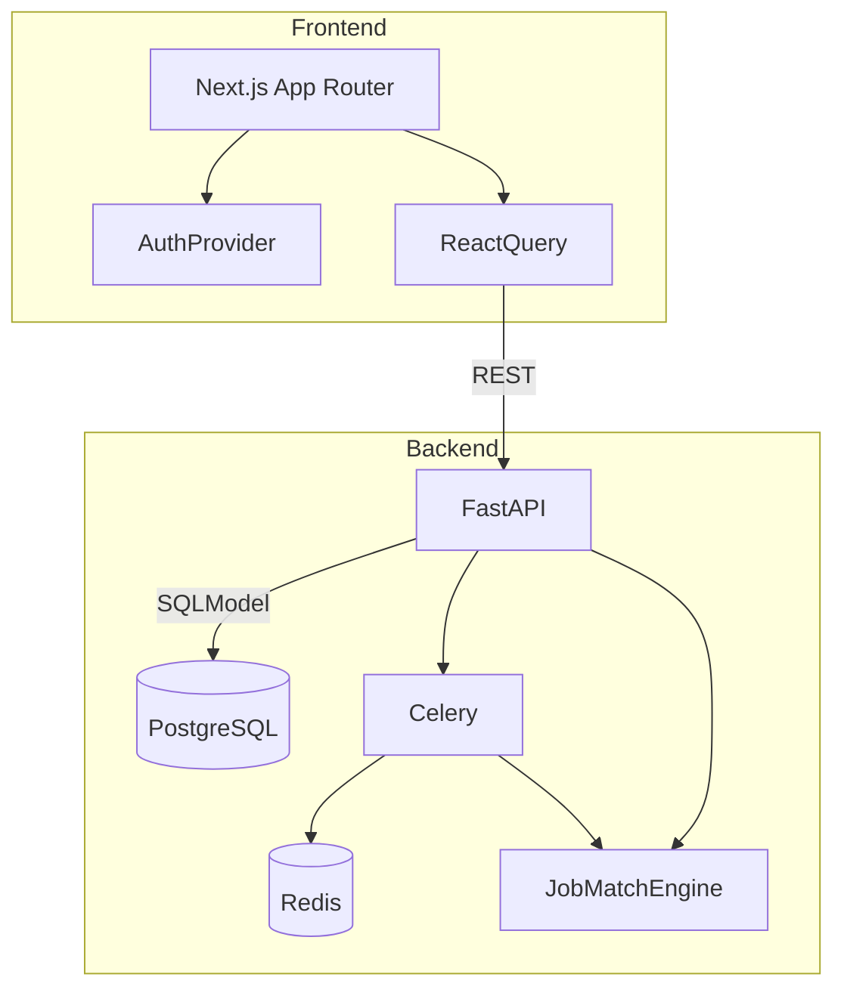

# Reimagined Job Board

An end-to-end job marketplace that pairs a FastAPI backend with a Next.js frontend and a local AI job-matching engine.

## Getting Started

1. Copy `.env.example` to `.env` and adjust settings.
2. Install dependencies:
   - Backend: `cd backend && poetry install`
   - Frontend: `cd frontend && npm install`
3. Start development services via Docker: `make dev`
4. Run database migrations and seed data: `make seed`
5. Access the frontend at http://localhost:3000 and backend docs at http://localhost:8000/api/v1/openapi.json.

## Features

- Candidate onboarding, profile management, and explainable recommendations.
- Employer job authoring, including bulk ingestion via Celery.
- Admin telemetry dashboard and feature flag toggles.
- AI engine integration abstracted by `engine_service`.
- Automated tests for backend (pytest) and frontend (Jest).

## Testing

- `make test` executes backend pytest suite and frontend Jest suite.
- `make lint` runs Ruff, mypy, and ESLint.

## Architecture Diagram

## Seed Data

Use `make seed` to populate demo users, employers, and job postings plus ingest them into the AI engine for instant recommendations.
